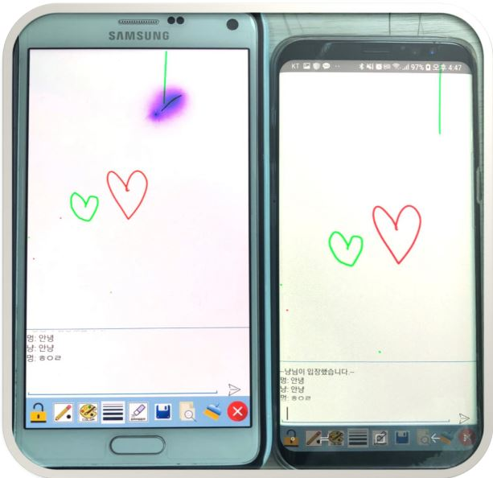
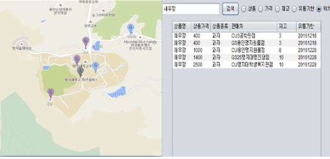
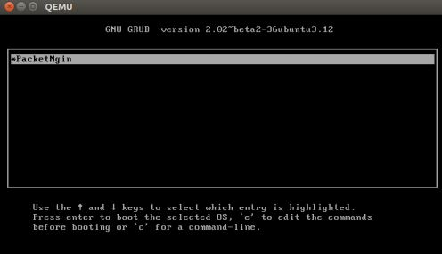
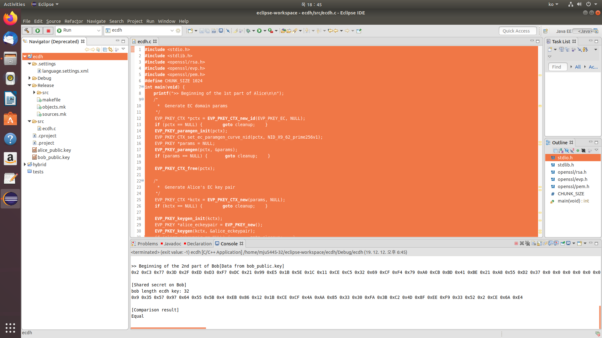

블로그(오류정리) : https://zena1010.tistory.com/category/%EC%BD%94%EB%94%A9 

## 안드로이드

### inging : 실시간 공유 그림판
실시간으로 그림판을 공유하여 함께 그릴 수 있는 그림판
server를 켠 뒤 client 앱을 시작하면 그림판을 사용할 수 있다.
6개 기기까지 테스트 완료

+ Ping 이용
+ client : android studio, java, xml
+ server : eclipse, java
+ 개발 기간 : 2018.03 ~ 2018.05
+ 본인의 역할 : 팀장
+ 한 일 : 그림판 구현, 실시간 공유 기능 설계 및 구현, 보고서 작성
+ 

### 롯데 배송 앱(직원용) layout 구현
https://github.com/ttogle918/EmulateLotteDelivery

### 안드로이드 사용 방법 ( 코드 )
https://github.com/ttogle918/Practice_Android 

----------

## findProduct - java
마트에서 재고량을 파악할 수 있도록 하는 상품탐색기이다. 
자료구조에 중점을 두어 가장 적절한 sort를 사용하는 것이 목적이다.

+ java + DB
+ 개발 기간 : 2016.09 ~ 2016.11
+ 본인의 역할 : 팀원 - 코딩(GUI, EventData), 품목 비교 및 정렬 설계, 검색어 자동완성, 보고서 작성
+ 기능
  + 로그인/회원가입
  + 위치 탐색
  + 문자열 자동 완성 / 정렬
  + 행사 상품
  + 인기 검색 / 즐겨찾기
+ 

---------

## 간단한 OS 만들기 - assembly
printf가 되는 os 생성
BIOS의 부팅 과정, MBR, assembler를 살펴보고 Bootloader, 32bit-kernel, os를 생성

ubuntu를 가상머신으로 하여 assembly 언어 사용
+ 

## 보안 - C언어

linux 환경에서 c의 openssl 라이브러리를 이용하여 구현

+ DES-cbc
+ AES-cbc
+ RSA
+ ecdh
+ hibrid

+ 

