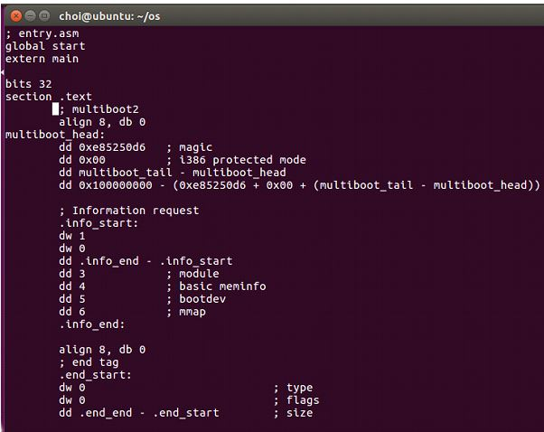
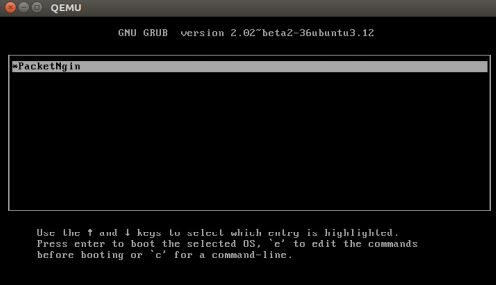

## 간단한 OS 만들기 - assembly
printf가 되는 os 만들기
BIOS의 부팅 과정, MBR, assembler를 살펴보고 Bootloader, 32bit-kernel, os를 만들었다.

ubuntu를 가상머신으로 하여 assembly 언어 사용

+ assembler 생성

+ bootloader 생성

+ entry.asm

+ 32-bit Kernel

+ 메모리 매핑
+ cursor 위치 조정 - vga ( vidio graphics adapter ) 적용

+ kernel update

+ Makefile로 실행

+ 실행결과

